**Resumen Ejecutivo:**
LTI es un sistema de seguimiento de candidatos (ATS) inteligente, diseñado para transformar radicalmente la experiencia de contratación en empresas tecnológicas en crecimiento. Ataca los puntos críticos de los ATS tradicionales—falta de automatización, procesos fragmentados y baja colaboración—proponiendo una plataforma colaborativa, predictiva y centrada en el usuario. El objetivo es acelerar las decisiones de contratación, mejorar la experiencia del candidato y maximizar la eficiencia operativa del equipo de reclutamiento. La oportunidad reside en diferenciarse de gigantes como Greenhouse y Lever mediante una UX superior y una capa de IA realmente asistencial.

**Propuesta de Valor Clave:**

* Automatización de tareas repetitivas para reducir carga operativa.
* Colaboración en tiempo real entre reclutadores y gerentes de contratación.
* Asistente de IA para descripciones de puestos, recomendaciones y resúmenes de entrevistas.
* Experiencia de usuario fluida y moderna.
* Time-to-hire reducido con mayor calidad en las contrataciones.

---

### Product Vision Board

| Elemento                   | Descripción                                                                                                                                             |
| -------------------------- | ------------------------------------------------------------------------------------------------------------------------------------------------------- |
| **Visión**                 | Ser el copiloto indispensable para los equipos de reclutamiento modernos, haciendo el proceso más inteligente, colaborativo y centrado en el candidato. |
| **Grupo Objetivo**         | Reclutadores y gerentes de contratación en startups y scaleups tecnológicas.                                                                            |
| **Necesidades / Problema** | Los ATS actuales son lentos, pasivos y no colaborativos. Falta inteligencia y automatización.                                                           |
| **Producto / Solución**    | ATS con IA integrada, espacios de trabajo colaborativos y automatización de tareas clave.                                                               |
| **Valor / Business Goals** | Reducción de time-to-hire, mejora de experiencia del candidato, eficiencia operativa y mejor toma de decisiones.                                        |

---

### Domain Process Map & Pain Points

```mermaid
graph TD
    A[Paso 1: Publicación de vacante] -->|Dolor: Requiere mucho tiempo y esfuerzo manual| B(Oportunidad: Generación automática con IA inclusiva);
    B --> C[Paso 2: Recepción y filtrado de CVs];
    C -->|Dolor: Filtro manual y poco escalable| D(Oportunidad: Screening automático con IA);
    D --> E[Paso 3: Coordinación de entrevistas];
    E -->|Dolor: Muchos emails/calendarios cruzados| F(Oportunidad: Agenda inteligente sincronizada);
    F --> G[Paso 4: Entrevistas y evaluación];
    G -->|Dolor: Feedback disperso y no estructurado| H(Oportunidad: Espacio colaborativo con formatos estandarizados);
    H --> I[Paso 5: Decisión de contratación];
    I -->|Dolor: Retrasos por falta de alineación| J(Oportunidad: Recomendaciones IA + visibilidad compartida);
```



---

### Lean Canvas

|                                                                                                                                |                                                                               |                                                                                        |
| ------------------------------------------------------------------------------------------------------------------------------ | ----------------------------------------------------------------------------- | -------------------------------------------------------------------------------------- |
| **Problema**                                                                                                                   | **Segmentos de Cliente**                                                      | **Propuesta Única de Valor**                                                           |
| - Procesos lentos y fragmentados<br>- Falta de colaboración<br>- No aprovechan IA para decisiones                              | - Reclutadores en startups<br>- Hiring managers en empresas tech              | "El ATS inteligente que acelera tus contrataciones con IA real y colaboración radical" |
| **Solución**                                                                                                                   | **Canales**                                                                   | **Flujo de Ingresos**                                                                  |
| - Automatización de screening<br>- Asistente de IA para job descriptions y entrevistas<br>- Espacios colaborativos por vacante | - Ventas directas B2B<br>- Webinars y demos<br>- Partner con aceleradoras     | - SaaS mensual por número de vacantes<br>- Planes escalables según número de usuarios  |
| **Estructura de Costos**                                                                                                       | **Métricas Clave**                                                            | **Ventaja Injusta**                                                                    |
| - Desarrollo de software<br>- Infraestructura cloud<br>- Soporte y ventas                                                      | - Time-to-hire<br>- NPS de candidatos<br>- Ratio de conversión de entrevistas | - UX superior<br>- IA entrenada con data propietaria de contrataciones exitosas        |

---

### Análisis Competitivo y Estrategia de Ataque

**Introducción:**
El mercado ATS está dominado por plataformas como Greenhouse, Lever y Workday. Aunque completas, muchas son percibidas como complejas, poco flexibles o excesivamente corporativas, lo que las hace subóptimas para startups.

**Tabla Comparativa:**

| Característica / Producto          | LTI ATS | Greenhouse | Lever | Workday |
| ---------------------------------- | ------- | ---------- | ----- | ------- |
| UX moderna e intuitiva             | ✅       | ❌          | ✅     | ❌       |
| IA para screening y sugerencias    | ✅       | ✅          | ✅     | ❌       |
| Colaboración en tiempo real        | ✅       | ❌          | ❌     | ❌       |
| Automatización de entrevistas      | ✅       | ❌          | ✅     | ❌       |
| Integración nativa con calendarios | ✅       | ✅          | ✅     | ✅       |
| Precio accesible para startups     | ✅       | ❌          | ❌     | ❌       |

**Análisis de Debilidades y Oportunidades:**
Greenhouse y Workday no están diseñados para la agilidad que requieren startups. Lever tiene buena interfaz, pero sigue careciendo de colaboración profunda y precios accesibles. Esto deja un espacio claro para un producto liviano, inteligente y centrado en la experiencia colaborativa.

**Estrategia de Ataque Recomendada:**
Nuestra estrategia será posicionarnos como el ATS preferido de startups tecnológicas al ofrecer un modelo SaaS accesible y una experiencia de colaboración radicalmente superior, apalancada por una IA entrenada con datos reales de contrataciones exitosas. Nos enfocaremos en equipos pequeños que necesitan velocidad y claridad, ignorados por los grandes jugadores.

### Artefacto 1: Resumen de Hallazgos de Investigación

1. **Desalineación entre reclutadores y hiring managers**: La colaboración fragmentada entre estos roles retrasa la toma de decisiones clave, lo que resulta en pérdida de talento.
2. **Carga operativa alta en tareas repetitivas**: Reclutadores pierden tiempo valioso en tareas manuales como agendamiento y filtrado inicial de CVs.
3. **Falta de inteligencia contextual en los sistemas actuales**: Los ATS tradicionales no ayudan a identificar patrones de éxito en contrataciones pasadas.
4. **Mala experiencia para el candidato**: Los retrasos, comunicaciones ineficaces y la falta de seguimiento perjudican la imagen de la empresa empleadora.

---

### Artefacto 2: Arquetipos de Usuario (Personas)

| Arquetipo              | Foto/Emoji | Objetivos Clave                                          | Dolores y Frustraciones                                     | Motivaciones                                    | Cita Clave                                   |
| ---------------------- | ---------- | -------------------------------------------------------- | ----------------------------------------------------------- | ----------------------------------------------- | -------------------------------------------- |
| Reclutador en startup  | 👩‍💻      | Llenar vacantes rápido y con talento de calidad          | Falta de tiempo, tareas repetitivas, herramientas dispersas | Agilidad, impacto, eficiencia                   | “Pierdo horas solo coordinando entrevistas.” |
| Hiring Manager técnico | 👨‍🔧      | Contratar sin fricción perfiles que encajen en el equipo | Feedback disperso, falta de visibilidad, decisiones lentas  | Buen fit cultural y técnico, minimizar fricción | “No sé en qué etapa está cada candidato.”    |

---

### Artefacto 3: Customer Journey Map Simplificado

```mermaid
sequenceDiagram
    participant 👩‍💻 Reclutador
    participant Sistema
    participant 👨‍🔧 HiringManager

    rect rgb(235, 245, 255)
    👩‍💻 Reclutador->>Sistema: Redacta vacante
    Sistema-->>👩‍💻 Reclutador: Sugerencias IA inclusiva
    Note right of 👩‍💻 Reclutador: 🙂 Inspiración rápida
    end

    rect rgb(235, 255, 245)
    Sistema-->>👩‍💻 Reclutador: Screening automático de CVs
    👩‍💻 Reclutador->>👨‍🔧 HiringManager: Comparte shortlist
    Note right of 👩‍💻 Reclutador: 🙂 Se siente productiva
    Note right of 👨‍🔧 HiringManager: 😐 Necesita contexto
    end

    rect rgb(255, 245, 235)
    👩‍💻 Reclutador->>Sistema: Agenda entrevistas
    Sistema-->>Todos: Calendarios sincronizados
    Note right of 👨‍🔧 HiringManager: 🙂 Sin esfuerzo de coordinación
    end

    rect rgb(235, 255, 250)
    👨‍🔧 HiringManager->>Sistema: Evalúa con plantilla
    Sistema-->>👩‍💻 Reclutador: Genera resumen IA
    Note right of 👩‍💻 Reclutador: 🙂 Tiene claridad
    end

    rect rgb(245, 235, 255)
    Todos->>Sistema: Decisión final colaborativa
    Sistema-->>Todos: Historial centralizado y métricas
    Note right of 👨‍🔧 HiringManager: 🙂 Decisión con confianza
    end
```



---

### Artefacto 4: Backlog Priorizado de Historias de Usuario

| Historia de Usuario                                                                                                                | Prioridad | Impacto | Esfuerzo Estimado |
| ---------------------------------------------------------------------------------------------------------------------------------- | --------- | ------- | ----------------- |
| Como reclutador, quiero que el sistema sugiera automáticamente descripciones inclusivas, para ahorrar tiempo y mejorar el alcance. | Must      | Alto    | Medio             |
| Como reclutador, quiero que se filtre automáticamente el CV, para enfocarme solo en candidatos relevantes.                         | Must      | Alto    | Alto              |
| Como hiring manager, quiero un espacio compartido para ver y evaluar candidatos con feedback estandarizado.                        | Must      | Alto    | Medio             |
| Como reclutador, quiero agendar entrevistas con sincronización automática de calendarios.                                          | Should    | Medio   | Medio             |
| Como hiring manager, quiero recibir un resumen automático de entrevistas grabadas.                                                 | Should    | Medio   | Alto              |
| Como equipo, quiero tomar decisiones en un dashboard con visibilidad completa de cada vacante.                                     | Could     | Alto    | Alto              |

---

### Artefacto 5: Checklist de Validación de Dominio y UX

* Usabilidad: ¿Puede un nuevo reclutador publicar una vacante en menos de 5 minutos?
* Automatización: ¿El sistema filtra al menos el 70% de los CVs sin intervención humana?
* Colaboración: ¿Hiring Managers pueden dejar feedback sin salir del sistema?
* UX: ¿El flujo completo (publicación a contratación) es navegable sin capacitación?
* IA: ¿El sistema sugiere candidatos relevantes con base en datos históricos?
* Regulación: ¿El sistema cumple con GDPR en almacenamiento de datos de candidatos?
* Valor: ¿Se reduce el time-to-hire en al menos un 15% tras 3 meses de uso?
### Artefacto 1: Casos de Uso Críticos

---

#### **ID del Caso de Uso:** CU-001

**Nombre:** Generar Descripciones Inclusivas de Vacantes
**Historia de Usuario Asociada:**
"Como reclutador, quiero que el sistema sugiera automáticamente descripciones inclusivas, para ahorrar tiempo y mejorar el alcance."
**Actor Principal:** 👩‍💻 Reclutador en startup
**Flujo Principal (Happy Path):**

1. El reclutador accede al módulo de creación de vacantes.
2. Introduce el título y responsabilidades básicas del puesto.
3. El sistema analiza la entrada y sugiere una versión inclusiva del texto.
4. El reclutador revisa y ajusta la propuesta si lo desea.
5. Guarda y publica la vacante.
   **Flujos Alternativos / Excepciones:**

* Si el sistema no encuentra suficientes datos para generar una sugerencia, se ofrece una plantilla básica editable.

---

#### **ID del Caso de Uso:** CU-002

**Nombre:** Filtrado Automático de Candidatos
**Historia de Usuario Asociada:**
"Como reclutador, quiero que se filtre automáticamente el CV, para enfocarme solo en candidatos relevantes."
**Actor Principal:** 👩‍💻 Reclutador en startup
**Flujo Principal (Happy Path):**

1. El sistema recibe nuevas postulaciones a una vacante activa.
2. Un motor de análisis semántico clasifica los CVs según criterios definidos por el reclutador.
3. El sistema presenta un shortlist priorizado.
4. El reclutador revisa y aprueba o descarta candidatos sugeridos.
   **Flujos Alternativos / Excepciones:**

* Si hay baja coincidencia, el sistema notifica al reclutador con los motivos y permite ajustar criterios.

---

#### **ID del Caso de Uso:** CU-003

**Nombre:** Evaluación Colaborativa de Candidatos
**Historia de Usuario Asociada:**
"Como hiring manager, quiero un espacio compartido para ver y evaluar candidatos con feedback estandarizado."
**Actor Principal:** 👨‍🔧 Hiring Manager técnico
**Flujo Principal (Happy Path):**

1. El hiring manager accede a la lista de candidatos asignados.
2. Visualiza el perfil, CV y anotaciones previas del reclutador.
3. Evalúa al candidato utilizando una plantilla estructurada (skills, fit cultural, etc.).
4. El sistema guarda el feedback y lo comparte con el reclutador en un panel centralizado.
   **Flujos Alternativos / Excepciones:**

* Si falta feedback de otros evaluadores, el sistema alerta antes de avanzar a decisión final.

---

### Artefacto 2: Arquitectura de Alto Nivel (Modelo C4)

#### **C1 - Diagrama de Contexto del Sistema**

```plantuml
@startuml
!includeurl https://raw.githubusercontent.com/plantuml-stdlib/C4-PlantUML/master/C4_Context.puml
Person(reclutador, "Reclutador", "Crea vacantes y gestiona candidatos")
Person(manager, "Hiring Manager", "Evalúa y selecciona candidatos")
System(systema, "Plataforma de Selección Inteligente", "Optimiza el proceso de reclutamiento con IA")

System_Ext(ats, "Sistema ATS existente", "Base de datos previa de candidatos")
System_Ext(email, "Proveedor de Email", "Para notificaciones y comunicación")
System_Ext(calendar, "Proveedor de Calendario", "Para sincronización de entrevistas")

reclutador -> systema : Publica vacantes, revisa candidatos
manager -> systema : Evalúa candidatos
systema -> ats : Consulta historial previo
systema -> email : Envía notificaciones
systema -> calendar : Sincroniza agendas
@enduml
```

#### **C2 - Diagrama de Contenedores**

```plantuml
@startuml
!includeurl https://raw.githubusercontent.com/plantuml-stdlib/C4-PlantUML/master/C4_Container.puml
System_Boundary(systema, "Plataforma de Selección Inteligente") {
  Container(web, "Frontend Web", "React", "Interfaz de usuario para reclutadores y managers")
  Container(api, "API Backend", "Node.js + Express", "Lógica de negocio y orquestación de procesos")
  Container(ai, "Servicio de IA", "Python + NLP", "Generación de descripciones y filtrado inteligente")
  Container(db, "Base de Datos", "PostgreSQL", "Almacena usuarios, vacantes, candidatos y feedback")
  Container(notify, "Servicio de Notificaciones", "Node.js", "Emails y alertas internas")
}

Person(reclutador, "Reclutador")
Person(manager, "Hiring Manager")

reclutador -> web
manager -> web
web -> api
api -> db
api -> ai
api -> notify
api -> calendar : API Calendario
api -> ats : API ATS externo
@enduml
```

---

### Artefacto 3: Modelo de Datos Conceptual (ERD)


## Artefacto 1: Prompt para Diagrama de Despliegue (diagramGPT)

Genera un diagrama de arquitectura de despliegue en la nube de AWS para un sistema ATS (Applicant Tracking System).

**Componentes y Servicios:**

- La **"Frontend Web" (React)** se aloja en un bucket de **S3** con distribución a través de **CloudFront**.
- La **"API Backend" (Node.js + Express)** está expuesta mediante **API Gateway**, que invoca funciones **AWS Lambda** para la lógica de negocio.
- El **"Servicio de IA" (Python + NLP)** se ejecuta como funciones **AWS Lambda** especializadas o contenedores en **AWS ECS Fargate** si se requiere persistencia de entorno.
- La **"Base de Datos"** se implementa como una instancia de **AWS RDS (PostgreSQL)** dentro de una **VPC privada**.
- El **"Servicio de Notificaciones"** es una función **Lambda** que se comunica con **Amazon SES** para envío de correos.
- La integración con servicios externos (calendario y ATS) se maneja a través de funciones Lambda específicas con acceso saliente controlado mediante una **NAT Gateway**.

**Estructura y Relaciones:**

- El usuario accede a la WebApp mediante CloudFront que sirve archivos estáticos desde S3.
- La WebApp realiza llamadas a **API Gateway**.
- API Gateway invoca funciones Lambda que orquestan llamadas al servicio de IA, base de datos y servicio de notificaciones.
- Todas las funciones Lambda, RDS y ECS se encuentran dentro de una **VPC privada**.
- La salida a internet para consumir APIs externas se realiza a través de una **NAT Gateway**.
- El acceso entre servicios se gestiona mediante **IAM Roles** y **Security Groups**.

**Estilo Visual:**

- Usa íconos oficiales de AWS para representar cada servicio.
- Indica claramente qué servicios están en la VPC privada.
- Distingue los componentes externos con bordes punteados.

---

## Artefacto 2: Diseño Detallado de Componentes (C4 - Nivel 3)

> Contenedor Seleccionado: API Backend (Node.js + Express)

```plantuml
@startuml
!includeurl https://raw.githubusercontent.com/plantuml-stdlib/C4-PlantUML/master/C4_Component.puml
Container(api, "API Backend", "Node.js + Express", "Lógica de negocio y orquestación")

Component(auth, "Auth Controller", "JWT y manejo de sesiones")
Component(jobCtrl, "Job Controller", "Gestión de vacantes")
Component(candidateCtrl, "Candidate Controller", "Gestión de candidatos y postulaciones")
Component(feedbackCtrl, "Feedback Controller", "Ingreso y consulta de evaluaciones")
Component(aiGateway, "AI Gateway", "Invoca servicio de IA para generación y filtrado")
Component(dbConnector, "Database Connector", "ORM para PostgreSQL")
Component(notificationService, "Notificación Service", "Envío de correos vía SES")

api -> auth
api -> jobCtrl
api -> candidateCtrl
api -> feedbackCtrl
jobCtrl -> dbConnector
candidateCtrl -> dbConnector
feedbackCtrl -> dbConnector
jobCtrl -> aiGateway
candidateCtrl -> aiGateway
feedbackCtrl -> notificationService
@enduml
